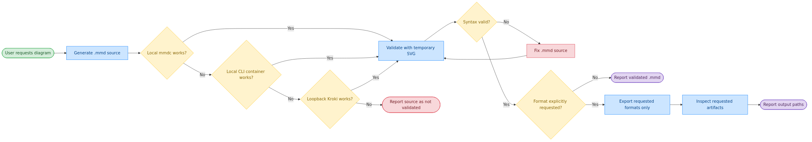

# mermaid-skill — Validated Diagrams, Local-Only Rendering

[](LICENSE)
[](https://github.com/robertonetresults/mermaid-skill/stargazers)
[](https://github.com/robertonetresults/mermaid-skill/network/members)
[](https://github.com/robertonetresults/mermaid-skill/commits/main)
[](https://agentskills.io)

[📖 Online Docs](https://robertonetresults.github.io/mermaid-skill/)

A skill that turns natural-language requests into always-validated `.mmd` source. PNG / SVG / PDF export is opt-in and uses only local `mmdc`, a network-isolated local Mermaid CLI container, or a loopback-only Kroki container API.

<p align="center">
  
</p>

## 🗺️ Origin and functional differences

This repository is a security-focused fork of the original [Agents365-ai/mermaid-skill](https://github.com/Agents365-ai/mermaid-skill), created and copyrighted by Agents365-ai. Both projects are distributed under the [MIT License](LICENSE).

| Area | Original skill | This fork |
| --- | --- | --- |
| Source validation | Validates as part of the export workflow | Always validates `.mmd`, including source-only requests |
| Persistent export | Produces PNG/SVG/PDF in the normal workflow | Exports only formats explicitly requested by the user |
| Rendering backends | Local `mmdc` or a hosted Kroki API | Local `mmdc`, network-isolated local CLI container, or loopback-only Kroki |
| Dependency handling | Setup may require installing `mmdc`, Chrome, or using `curl` | Never installs packages or pulls container images implicitly |
| Installation lifecycle | General agent/plugin installation paths | Ownership-checked `install`, `update`, and `uninstall` for Codex and custom targets |
| Documentation scope | Multilingual documentation and language-specific trigger aliases | English documentation without language-specific aliases |

## ✨ Highlights

- **17+ diagram types** — flowchart, sequence, class, ER, state, Gantt, pie, git graph, C4 context, mind map, and more, all with automatic layout (no x/y coordinates)
- **Always validated** — every `.mmd` goes through a fix-and-revalidate loop, even when no export is requested
- **Vision self-check + review loop** — reads the exported PNG to catch readability/layout defects auto-layout can't prevent (clipped labels, cramped density, wrong orientation), auto-fixes (≤2 rounds), then iterates with you on feedback (≤5 rounds)
- **Enterprise-safe local backends** — local `mmdc`, then a local Mermaid CLI container, then loopback-only Kroki
- **Opt-in export** — persistent PNG / SVG / PDF files are created only when the user explicitly names the format
- **Text source = version-control friendly** — `.mmd` is plain text, diffs cleanly in PRs, and embeds directly in GitHub / GitLab READMEs
- **Proactive triggering** — auto-activates when discussing architecture, API flows, or state machines
- **No public rendering services** — diagram source and artifacts remain inside the local environment

## 🖼️ Examples

> [!TIP]
> **The hero image above was generated from this single prompt:**

```
Create a microservices e-commerce architecture with Mobile/Web clients,
API Gateway, User/Order/Product/Payment services, and User DB / Order DB /
Product DB / Redis Cache
```

### More diagram types

Mermaid auto-lays-out 17+ types — each of these was generated from a one-line prompt and run through the validate → export → self-check pipeline:

<table>
  <tr>
    <td align="center"><br><sub><b>Sequence</b> · auth flow</sub></td>
    <td align="center"><br><sub><b>Class</b> · domain model</sub></td>
    <td align="center"><br><sub><b>State</b> · order lifecycle</sub></td>
  </tr>
  <tr>
    <td align="center"><br><sub><b>ER</b> · e-commerce schema</sub></td>
    <td align="center"><br><sub><b>Gantt</b> · launch plan</sub></td>
    <td align="center"><br><sub><b>Git graph</b> · branch strategy</sub></td>
  </tr>
</table>

Full feature matrix in [docs/features.md](docs/features.md). Source `.mmd` files for the hero, workflow, and gallery images live alongside their PNGs in [`assets/`](assets/) (`example-{sequence,class,state,er,gantt,gitgraph}.mmd`).

## 🚀 Installation

### 1. Prepare at least one local validation backend

| Option | Command | When to use |
| --- | --- | --- |
| **A — Local `mmdc`** | `mmdc --version` | First choice when already installed with working Chromium |
| **B — Local CLI container** | Preload `minlag/mermaid-cli:latest` | Network-isolated fallback; never pulled by the skill |
| **C — Local Kroki containers** | Gateway + Mermaid companion on loopback | Final PNG/SVG fallback; never a public API |

The skill probes these backends in order. It never installs packages, pulls images, or calls a hosted renderer. See [local rendering setup](skills/mermaid-skill/reference/LOCAL-RENDERING.md).

### 2. Clone this fork and install for Codex

```bash
git clone git@github.com:robertonetresults/mermaid-skill.git
cd mermaid-skill
./manage-skill.sh install
```

If SSH access is unavailable, clone `https://github.com/robertonetresults/mermaid-skill.git` instead. The default destination is `${CODEX_HOME:-$HOME/.codex}/skills/mermaid-skill`; keep the clone because it remains the source for future updates.

### 3. Update or uninstall

```bash
# Reinstall from the current local checkout (no network)
./manage-skill.sh update

# Fast-forward the configured Git remote, then reinstall
./manage-skill.sh update --pull

# Remove only the installation owned by this installer
./manage-skill.sh uninstall
```

The script refuses to overwrite or remove an existing directory that does not contain its ownership marker.

### Other skills-compatible agents

The skill follows the open Agent Skills directory format. Install it in the cross-client user or project convention, or provide an agent-specific directory:

```bash
./manage-skill.sh install --agents
./manage-skill.sh install --project /path/to/project
./manage-skill.sh install --destination /path/to/agent/skills
```

Use the same target option with `update` and `uninstall`. Agent discovery paths vary, so only Codex is guaranteed; restart the agent or begin a new session after installation.

## ⚡ Quick Start

After installation, just describe what you want — e.g. a JWT auth sequence:

```
Create a sequence diagram for JWT login: Client posts credentials to API
Gateway, gateway calls Auth Service, Auth Service reads the User DB,
verifies the password hash, and returns a signed JWT back through the
gateway to the client. Show the failure path for an invalid password too.
```

The skill writes the `.mmd` source and always validates it, fixing and re-validating syntax errors. It reports only the source unless you explicitly request PNG, SVG, or PDF.

## 🧩 Supported Diagram Types

| Type | Keyword | Use for |
| --- | --- | --- |
| Flowchart | `flowchart TD/LR` | processes, pipelines, decision trees |
| Sequence | `sequenceDiagram` | API calls, auth flows, message passing |
| Class | `classDiagram` | OOP models, domain entities, inheritance |
| ER | `erDiagram` | database schemas, relationships |
| State | `stateDiagram-v2` | state machines, lifecycles |
| Gantt | `gantt` | project timelines, sprint plans |
| Pie | `pie` | proportions, distributions |
| Git Graph | `gitGraph` | branch strategies, GitFlow |
| C4 Context | `C4Context` | high-level architecture |
| Mind Map | `mindmap` | topic breakdowns, brainstorms |
| Journey | `journey` | user journeys |
| Use Case | `usecase-beta` | actor–system interactions (UML) |
| Cynefin | `cynefin-beta` | sense-making / complexity domains |
| Event Modeling | `eventmodeling` | event-driven system timelines |
| Tree View | `treeView-beta` | file / directory hierarchies |
| Wardley Maps | `wardley-beta` | business strategy / value chains |

Per-type syntax references live in [`skills/mermaid-skill/reference/`](skills/mermaid-skill/reference/) and full feature matrix in [docs/features.md](docs/features.md).

## 🔄 How it works

<p align="center">
  
</p>

Behind the scenes: **write `.mmd` → select a permitted local backend → validate syntax → fix and re-validate on error → report the validated source, or export only explicitly requested formats → inspect requested output → report paths**. Walkthrough in [docs/workflow.md](docs/workflow.md).

## 🆚 Comparison

### vs Native Agent (no skill)

| Feature | Native agent | mermaid-skill |
| --- | --- | --- |
| Writes Mermaid syntax | ✅ inline | ✅ guided by examples + reference files |
| Validation of source | ❌ often skipped without export | ✅ always required, retries on error |
| Self-check after export | ❌ never looks at the render | ✅ vision reads the PNG, auto-fixes layout/readability (≤2 rounds) |
| Iterative review loop | ❌ manual re-prompt | ✅ targeted `.mmd` edits, 5-round safety valve |
| Export to PNG / SVG / PDF | ❌ manual | ✅ only when the format is explicitly requested |
| Local-only fallback | ❌ | ✅ network-isolated CLI container, then loopback Kroki |
| Proactive triggering | ❌ only when explicitly asked | ✅ auto-triggers on 3+ components, API flows, state machines |
| Diagram-type guidance | generic | ✅ 17+ type table with copy-paste templates |

## 🎯 When to use (and when not to)

**Good fit:**

- Diagrams-as-code — define in text, get automatic layout, version-control friendly, embeds straight into Markdown / README / docs
- Quick flowcharts, sequence, class, state, ER, gantt, and mindmaps from a text description
- When the source should live next to your code and re-render automatically

**Reach for a sibling skill instead when you need:**

- **Pixel-precise placement, custom layout, branded icons, or heavy styling** → [drawio-skill](https://github.com/Agents365-ai/drawio-skill)
- **A hand-drawn / sketchy aesthetic** → [excalidraw-skill](https://github.com/Agents365-ai/excalidraw-skill) or [tldraw-skill](https://github.com/Agents365-ai/tldraw-skill)
- **A freeform whiteboard or freehand drawing** → [tldraw-skill](https://github.com/Agents365-ai/tldraw-skill)
- **Strict, conventional UML notation** → [plantuml-skill](https://github.com/Agents365-ai/plantuml-skill)

## 🔗 Related Skills

Part of the [Agents365-ai diagram-skill family](https://github.com/Agents365-ai) — pick the right tool for the job:

| Skill | Style | Best for |
| --- | --- | --- |
| [drawio-skill](https://github.com/Agents365-ai/drawio-skill) | XML, manual layout control | Polished architecture diagrams, ML model figures |
| [excalidraw-skill](https://github.com/Agents365-ai/excalidraw-skill) | Hand-drawn / sketchy | Whiteboard mockups, informal diagrams |
| [plantuml-skill](https://github.com/Agents365-ai/plantuml-skill) | UML-focused | Class / sequence diagrams in CI pipelines |
| [tldraw-skill](https://github.com/Agents365-ai/tldraw-skill) | Whiteboard collaboration | Casual sketches, FigJam-style boards |

## ❤️ Support

If this skill helps you, consider supporting the author:

<table>
  <tr>
    <td align="center">
      
      <br>
      <b>WeChat Pay</b>
    </td>
    <td align="center">
      
      <br>
      <b>Alipay</b>
    </td>
    <td align="center">
      
      <br>
      <b>Buy Me a Coffee</b>
    </td>
    <td align="center">
      
      <br>
      <b>Give a Reward</b>
    </td>
  </tr>
</table>

## 👤 Author

**Agents365-ai**

- GitHub: <https://github.com/Agents365-ai>
- Bilibili: <https://space.bilibili.com/441831884>

## 📄 License

[MIT](LICENSE)
