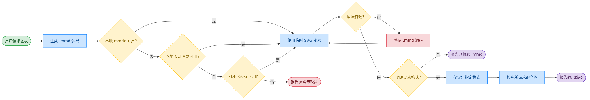

# mermaid-skill —— 始终校验，仅限本地渲染

[](LICENSE)
[](https://github.com/robertonetresults/mermaid-skill/stargazers)
[](https://github.com/robertonetresults/mermaid-skill/network/members)
[](https://github.com/robertonetresults/mermaid-skill/commits/main)

[](https://agentskills.io)
[English](README.md) · **中文** · [文档](docs/zh.html)

一个把自然语言转成始终经过校验的 `.mmd` 源码的技能。只有用户明确指定格式时才导出 PNG / SVG / PDF，并且只使用本地 `mmdc`、禁用网络的本地 Mermaid CLI 容器或仅监听回环地址的 Kroki 容器 API。

<p align="center">
  
</p>

## ✨ 核心亮点

- **17+ 种图表类型** —— 流程图、时序图、类图、ER、状态图、甘特、饼图、Git 图、C4 上下文、思维导图等,全部自动布局(无需 x/y 坐标)
- **始终校验** —— 即使不导出，每个 `.mmd` 也执行“修复并重新校验”循环
- **视觉自检 + 评审循环** —— 读取导出的 PNG,捕捉自动布局也防不住的可读性/排版缺陷(标签被截断、过于拥挤、方向不当),自动修复(≤2 轮),再根据你的反馈迭代(≤5 轮)
- **企业安全的本地后端** —— 本地 `mmdc`、本地 Mermaid CLI 容器、仅回环地址 Kroki
- **按需导出** —— 只有用户明确指定格式时才创建持久化 PNG / SVG / PDF
- **文本源码 = 友好版本管理** —— `.mmd` 是纯文本,在 PR 里 diff 清晰,可直接嵌入 GitHub / GitLab README
- **主动触发** —— 讨论架构、API 流程、状态机时自动激活(中英文关键词都支持)
- **禁用公共渲染服务** —— 图表源码和产物始终留在本地环境

## 🖼️ 示例

> [!TIP]
> **页首那张图就是用下面这条提示词生成的:**

```
画一个微服务电商架构图,包含 Mobile/Web 客户端、API 网关、
User/Order/Product/Payment 服务,以及 User DB / Order DB /
Product DB / Redis Cache
```

### 更多图表类型

Mermaid 自动布局 17+ 种类型 —— 下面每张都由一句提示词生成,并走了 校验 → 导出 → 自检 流程:

<table>
  <tr>
    <td align="center"><br><sub><b>时序图</b> · 认证流程</sub></td>
    <td align="center"><br><sub><b>类图</b> · 领域模型</sub></td>
    <td align="center"><br><sub><b>状态图</b> · 订单生命周期</sub></td>
  </tr>
  <tr>
    <td align="center"><br><sub><b>ER 图</b> · 电商 schema</sub></td>
    <td align="center"><br><sub><b>甘特图</b> · 发布计划</sub></td>
    <td align="center"><br><sub><b>Git 图</b> · 分支策略</sub></td>
  </tr>
</table>

完整能力矩阵见 [docs/features_CN.md](docs/features_CN.md)。页首、工作流与画廊插图的源 `.mmd` 与导出 PNG 都放在 [`assets/`](assets/) 目录(`example-{sequence,class,state,er,gantt,gitgraph}.mmd`)。

## 🚀 安装

### 1. 准备至少一个本地校验后端

| 选项 | 命令 | 适用场景 |
| --- | --- | --- |
| **A —— 本地 `mmdc`** | `mmdc --version` | 已安装且 Chromium 可用时优先 |
| **B —— 本地 CLI 容器** | 预加载 `minlag/mermaid-cli:latest` | 禁用网络的第二选择，技能绝不拉取镜像 |
| **C —— 本地 Kroki 容器** | 回环地址上的网关 + Mermaid companion | PNG/SVG 的最终选择，绝不调用公共 API |

技能按上述顺序探测后端，绝不自动安装软件、拉取镜像或调用托管渲染器。配置见[本地渲染说明](skills/mermaid-skill/reference/LOCAL-RENDERING.md)。

### 2. 克隆本 fork 并为 Codex 安装

```bash
git clone git@github.com:robertonetresults/mermaid-skill.git
cd mermaid-skill
./manage-skill.sh install
```

如果不能使用 SSH，可改用 `https://github.com/robertonetresults/mermaid-skill.git`。默认安装到 `${CODEX_HOME:-$HOME/.codex}/skills/mermaid-skill`；请保留 clone，它也是后续更新的来源。

### 3. 更新或卸载

```bash
# 从当前本地 checkout 重新安装（不访问网络）
./manage-skill.sh update

# 仅快进更新配置的 Git remote，然后重新安装
./manage-skill.sh update --pull

# 只删除由此安装器管理的安装目录
./manage-skill.sh uninstall
```

脚本拒绝覆盖或删除没有所有权标记的现有目录。

### 其他兼容 Agent Skills 的智能体

本 skill 使用开放的 Agent Skills 目录格式。可以安装到跨客户端的用户目录、项目目录，或指定其他 agent 的 skills 目录：

```bash
./manage-skill.sh install --agents
./manage-skill.sh install --project /path/to/project
./manage-skill.sh install --destination /path/to/agent/skills
```

更新和卸载时使用相同的目标选项。不同 agent 的发现目录可能不同，因此只保证 Codex；安装后请重启 agent 或开始新会话。

## ⚡ 快速开始

装好之后直接描述你想要的图表,比如一个 JWT 认证时序图:

```
画一个 JWT 登录的时序图:Client 把账号密码发给 API Gateway,
Gateway 调 Auth Service,Auth Service 查 User DB、校验密码哈希,
然后把签名后的 JWT 沿路径返回给 Client。同时画出密码错误的失败分支。
```

技能会写入 `.mmd` 源码并始终校验；语法错误会修复后重新校验。除非你明确要求 PNG、SVG 或 PDF，否则只报告源码路径。

## 🧩 支持的图表类型

| 类型 | 关键词 | 适用场景 |
| --- | --- | --- |
| 流程图 | `flowchart TD/LR` | 业务流程、流水线、决策树 |
| 时序图 | `sequenceDiagram` | API 调用、认证流程、消息传递 |
| 类图 | `classDiagram` | OOP 模型、领域实体、继承关系 |
| ER 图 | `erDiagram` | 数据库模式、表关系 |
| 状态图 | `stateDiagram-v2` | 状态机、生命周期 |
| 甘特图 | `gantt` | 项目时间线、迭代规划 |
| 饼图 | `pie` | 占比、分布 |
| Git 图 | `gitGraph` | 分支策略、GitFlow |
| C4 上下文 | `C4Context` | 高层架构 |
| 思维导图 | `mindmap` | 主题拆解、头脑风暴 |
| 用户旅程 | `journey` | 用户路径 |
| 用例图 | `usecase-beta` | 参与者与系统交互 (UML) |
| Cynefin | `cynefin-beta` | 复杂度域 / 决策框架 |
| 事件建模 | `eventmodeling` | 事件驱动系统时间线 |
| 树视图 | `treeView-beta` | 文件 / 目录层级 |
| Wardley 地图 | `wardley-beta` | 商业战略 / 价值链 |

各类型语法参考见 [`skills/mermaid-skill/reference/`](skills/mermaid-skill/reference/),完整能力矩阵见 [docs/features_CN.md](docs/features_CN.md)。

## 🔄 工作流程

<p align="center">
  
</p>

幕后流程:**写入 `.mmd` → 选择允许的本地后端 → 校验语法 → 出错则修复并重新校验 → 报告已校验源码，或仅导出明确要求的格式 → 检查所请求的产物 → 报告路径**。详见 [docs/workflow_CN.md](docs/workflow_CN.md)。

## 🆚 对比

### 对比原生智能体(无 skill)

| 功能 | 原生智能体 | mermaid-skill |
| --- | --- | --- |
| 写 Mermaid 语法 | ✅ 内置 | ✅ 配示例 + 参考文档引导 |
| 源码校验 | ❌ 未导出时经常跳过 | ✅ 始终执行，出错自动重试 |
| 导出后自检 | ❌ 从不看渲染结果 | ✅ 视觉读取 PNG,自动修复排版/可读性(≤2 轮) |
| 迭代评审循环 | ❌ 手动重新提示 | ✅ 定向 `.mmd` 编辑,5 轮安全阀 |
| 导出为 PNG / SVG / PDF | ❌ 手动执行 | ✅ 仅在明确要求格式时执行 |
| 仅本地备选 | ❌ | ✅ 禁用网络的 CLI 容器，再到回环 Kroki |
| 主动触发 | ❌ 必须显式要求 | ✅ 3+ 组件、API 流程、状态机自动触发 |
| 中英双语触发 | ❌ 仅英文 | ✅ 中英关键词都支持 |
| 图表类型引导 | 一般化 | ✅ 17+ 类型表 + 可复制模板 |

## 🎯 何时用(以及何时别用)

**适合:**

- 以代码画图 —— 文本定义、自动布局、对版本控制友好,可直接嵌入 Markdown / README / 文档
- 从文字描述快速生成流程图、时序图、类图、状态图、ER 图、甘特图、思维导图
- 希望图的源码就放在代码旁边、自动重新渲染的场景

**这些情况请改用同系列的其它 skill:**

- **像素级定位、自定义布局、品牌图标、复杂样式** → [drawio-skill](https://github.com/Agents365-ai/drawio-skill)
- **手绘 / 潦草观感** → [excalidraw-skill](https://github.com/Agents365-ai/excalidraw-skill) 或 [tldraw-skill](https://github.com/Agents365-ai/tldraw-skill)
- **无限画布 / 自由手绘** → [tldraw-skill](https://github.com/Agents365-ai/tldraw-skill)
- **严格、规范的 UML 记法** → [plantuml-skill](https://github.com/Agents365-ai/plantuml-skill)

## 🔗 相关 Skill

[Agents365-ai 图表 skill 家族](https://github.com/Agents365-ai) 一员 —— 按场景挑工具:

| Skill | 风格 | 适用场景 |
| --- | --- | --- |
| [drawio-skill](https://github.com/Agents365-ai/drawio-skill) | XML、可手动控制布局 | 精修架构图、ML 模型图 |
| [excalidraw-skill](https://github.com/Agents365-ai/excalidraw-skill) | 手绘 / 草图 | 白板原型、非正式图 |
| [plantuml-skill](https://github.com/Agents365-ai/plantuml-skill) | UML 专精 | CI 流水线里的类图 / 序列图 |
| [tldraw-skill](https://github.com/Agents365-ai/tldraw-skill) | 白板协作 | 随手画、FigJam 风格 |

## ❤️ 支持作者

如果这个 skill 对你有帮助,欢迎支持作者:

<table>
  <tr>
    <td align="center">
      
      <br>
      <b>微信支付</b>
    </td>
    <td align="center">
      
      <br>
      <b>支付宝</b>
    </td>
    <td align="center">
      
      <br>
      <b>Buy Me a Coffee</b>
    </td>
    <td align="center">
      
      <br>
      <b>打赏</b>
    </td>
  </tr>
</table>

## 👤 作者

**Agents365-ai**

- GitHub: <https://github.com/Agents365-ai>
- Bilibili: <https://space.bilibili.com/441831884>

## 📄 许可证

[MIT](LICENSE)
