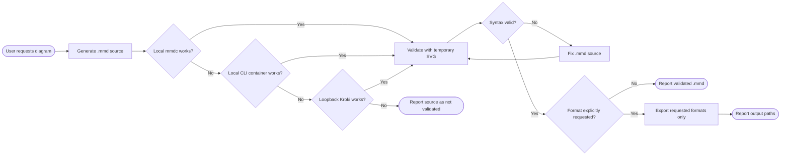

# Workflow & File Structure

[← Back to README](../README.md)

## How It Works

Every generated source is validated. Export remains an explicit opt-in.




The temporary validation SVG is deleted automatically. Persistent PNG, SVG, and PDF files are created only when the user explicitly requests those formats.

## Skill Structure

```text
skills/mermaid-skill/
├── SKILL.md
├── scripts/
│   └── render-mermaid.sh
└── reference/
    ├── LOCAL-RENDERING.md
    ├── FLOWCHART.md
    ├── SEQUENCE.md
    ├── CLASS-ER.md
    └── OTHER-TYPES.md
```
