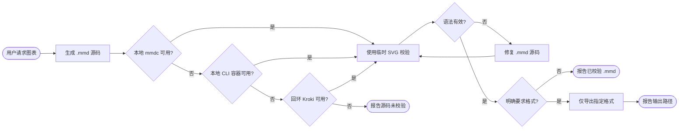

# 工作流程与文件结构

[← 返回 README](../README_CN.md)

## 工作原理

每个生成的源码都必须校验，导出则必须由用户明确要求。




用于校验的临时 SVG 会自动删除。只有用户明确指定格式时才创建持久化 PNG、SVG 或 PDF。

## 技能结构

```text
skills/mermaid-skill/
├── SKILL.md
├── scripts/
│   └── render-mermaid.sh
└── reference/
    ├── LOCAL-RENDERING.md
    ├── FLOWCHART.md
    ├── SEQUENCE.md
    ├── CLASS-ER.md
    └── OTHER-TYPES.md
```
