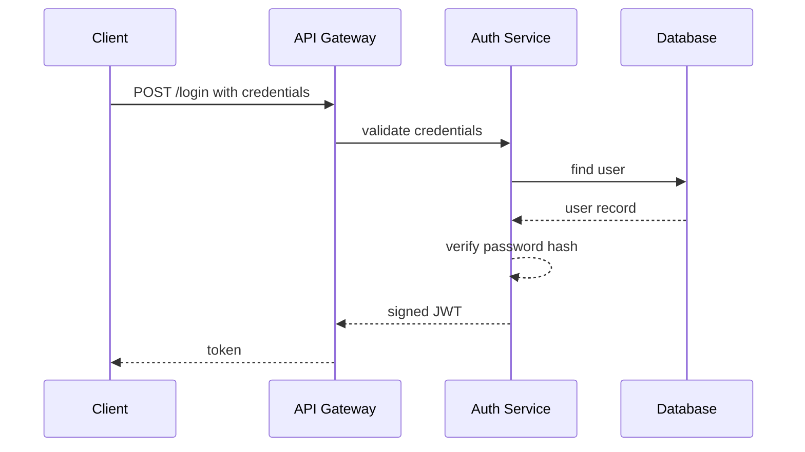
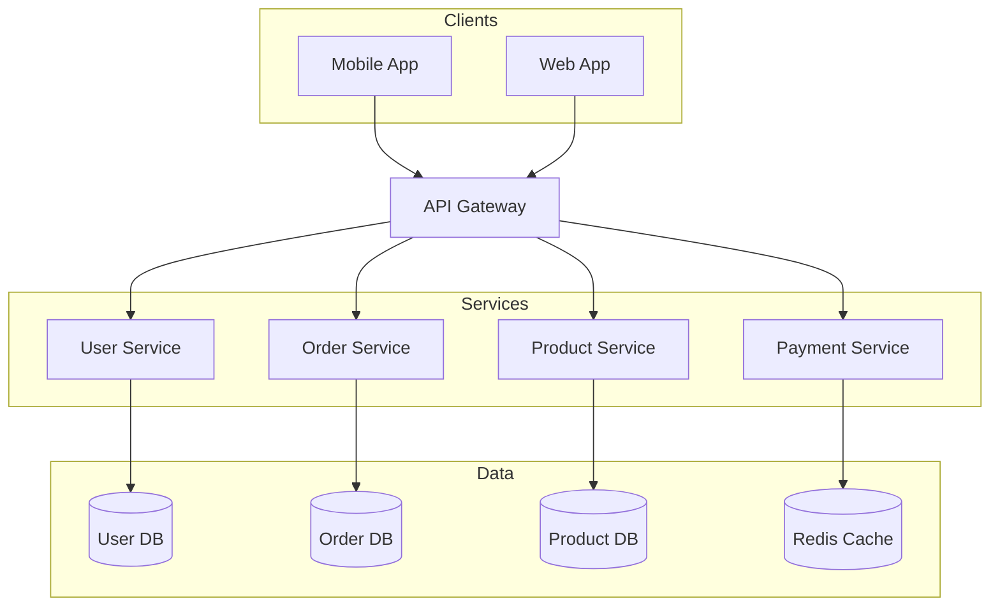
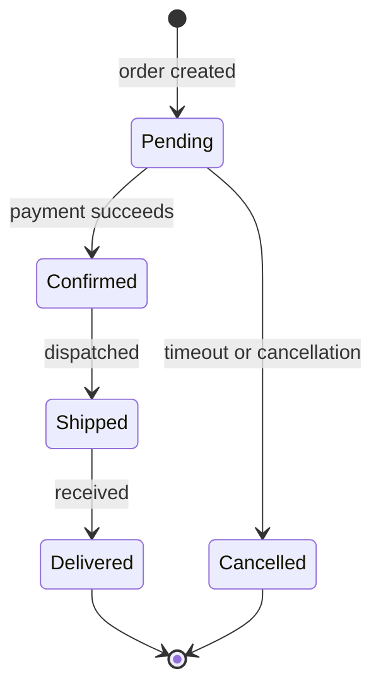
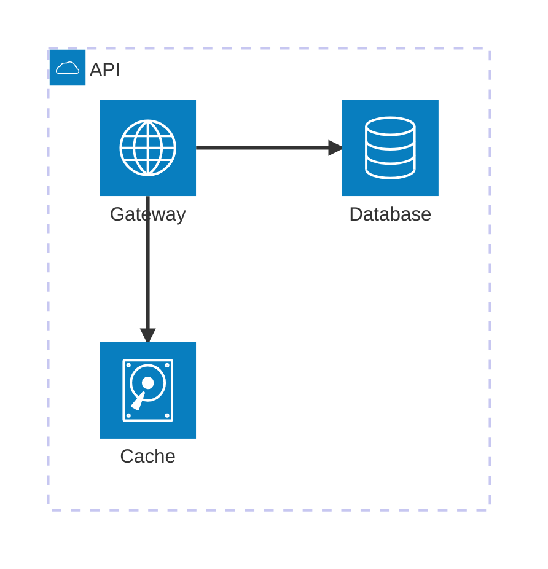

# Mermaid Diagrams

Create version-control-friendly `.mmd` files with automatic layout. Always validate the source, but export a persistent PNG, SVG, or PDF only when the user explicitly requests that format.

## Security invariants

- Never send diagram source, labels, configuration, or rendered artifacts to a public service.
- Never call `kroki.io`, `mermaid.live`, another hosted renderer, or an arbitrary HTTP endpoint.
- Never install a package, pull a container image, or use `npx` as an implicit fallback.
- Reject Mermaid source that references external resources or URLs before validation or export.
- Accept Kroki only over plain HTTP on loopback (`127.0.0.1`, `localhost`, or `::1`). Do not follow redirects or use a proxy.
- Run the Mermaid CLI container with networking disabled and pulling disabled.

Read [reference/LOCAL-RENDERING.md](reference/LOCAL-RENDERING.md) when setting up or troubleshooting a rendering backend.

## When to use / when not to use

Use this skill for diagrams-as-code with automatic layout: flowcharts, sequences, classes, states, ER models, Gantt charts, mind maps, and architectures.

Use another format for pixel-precise placement, heavy branding, freehand drawing, or strict conventional UML notation.

## Required workflow

1. Choose the diagram type.
2. Write the `.mmd` source to disk.
3. Run `scripts/render-mermaid.sh validate diagram.mmd`.
4. If validation reports a Mermaid syntax error, make the smallest source correction and validate again. Repeat until validation succeeds or the source cannot be corrected.
5. If no backend is available, keep the `.mmd` file, clearly report that it is **not validated**, and do not claim success.
6. If the user did not explicitly request PNG, SVG, or PDF, stop after successful validation and report only the `.mmd` path.
7. If the user explicitly requested one or more formats, run `scripts/render-mermaid.sh export diagram.mmd diagram.<format>` once per requested format.
8. Inspect only the requested artifacts. Re-validate and re-export after every source correction.

If the user asks for an image or export without naming a format, ask whether they want PNG, SVG, or PDF. Do not infer PNG.

### Backend order

The helper enforces this order for both validation and export:

1. A working local `mmdc` executable.
2. Docker or Podman with the already-local `minlag/mermaid-cli:latest` image (or the approved image in `MERMAID_CLI_IMAGE`).
3. The local Kroki API configured by `KROKI_URL`, defaulting to `http://127.0.0.1:8000`.

Backend probes use a harmless built-in diagram. A Mermaid error in the user's source is not backend unavailability: fix the source and re-validate with the same selected backend.

Kroki supports Mermaid PNG and SVG, but not PDF. If both `mmdc` backends are unavailable, report PDF export as unavailable; never use a remote converter.

## Validation

Validation is mandatory even when no export was requested. The helper renders an SVG into a temporary directory, removes it automatically, and never presents it as user output.

Common syntax corrections:

- Quote labels containing punctuation or special characters.
- Use `->>` and `-->>` in sequence diagrams; use `-->` in flowcharts.
- Declare sequence participants explicitly.
- Quote subgraph names containing spaces.

A Chrome/Puppeteer failure is a backend setup problem, not a diagram error. Let the helper select the next local backend rather than rewriting valid Mermaid syntax.

## Self-check (vision)

Syntax validation does not prove that a rendered diagram is readable. When the user explicitly requested PNG and vision is available, inspect that PNG after export:

| Check | What to look for | Fix |
| --- | --- | --- |
| Label truncation | Node or edge text is clipped | Shorten the label or wrap it with ` ` |
| Cramped density | Too many nodes or tangled lines | Flip `TD`↔`LR`, introduce `subgraph`s, or reduce nodes |
| Wrong orientation | Diagram is far too wide or tall | Change flowchart direction or set `direction` for class/state diagrams |
| Edge spaghetti | Crossings make relationships hard to follow | Reorder declarations and group related nodes |
| Wrong diagram type | The notation does not fit the content | Switch to sequence, Gantt, state, or another suitable type |
| Low contrast | Text blends into node fills | Adjust `classDef` or the Mermaid theme |

- Perform at most two automatic self-check corrections.
- Re-validate the `.mmd` and re-export only the requested formats after every correction.
- If vision is unavailable, report the requested PNG without claiming that it was visually checked.
- Never create an extra PNG solely to inspect an SVG or PDF request.

## Review loop

After self-check, show or report the requested artifacts and collect feedback. Apply the smallest relevant `.mmd` edit:

| User request | Edit action |
| --- | --- |
| Change a label | Edit the node or edge text |
| Add or remove a node or edge | Add or delete the matching declaration |
| Change a color | Adjust `classDef` and the corresponding `class` assignment |
| Change layout direction | Swap `TD`↔`LR` or set `direction` for class/state diagrams |
| Restructure or group | Wrap related nodes in a `subgraph` or regenerate the affected section |

After every edit, validate again and re-export every format originally requested by the user. Overwrite the same `.mmd` and output files rather than creating `v1`, `v2`, and similar variants. Stop the review loop after five rounds and report any remaining limitation; never redirect the user to a public editor or renderer.

## Diagram types

| Type | Keyword | Use for |
| --- | --- | --- |
| Flowchart | `flowchart TD/LR` | Processes, pipelines, decisions |
| Sequence | `sequenceDiagram` | API calls, message passing |
| Class | `classDiagram` | OOP models, data structures |
| ER | `erDiagram` | Database schemas |
| State | `stateDiagram-v2` | State machines and lifecycles |
| Gantt | `gantt` | Project timelines |
| Pie | `pie` | Proportions |
| Git Graph | `gitGraph` | Branch strategies |
| C4 Context | `C4Context` | High-level system context |
| Architecture | `architecture-beta` | Cloud and CI/CD layouts |
| Mind Map | `mindmap` | Topic breakdowns |
| User Journey | `journey` | User-experience flows |
| Use Case | `usecase-beta` | Actor-system interactions |
| Cynefin | `cynefin-beta` | Complexity domains |
| Event Modeling | `eventmodeling` | Event-driven timelines |
| Tree View | `treeView-beta` | File and directory hierarchies |
| Wardley Maps | `wardley-beta` | Strategy and value chains |

## Syntax references

- Flowchart: [reference/FLOWCHART.md](reference/FLOWCHART.md)
- Sequence: [reference/SEQUENCE.md](reference/SEQUENCE.md)
- Class and ER: [reference/CLASS-ER.md](reference/CLASS-ER.md)
- Architecture: [reference/ARCHITECTURE.md](reference/ARCHITECTURE.md)
- Use case: [reference/USECASE.md](reference/USECASE.md)
- Other types: [reference/OTHER-TYPES.md](reference/OTHER-TYPES.md)

## Examples

### Example 1: API authentication flow

**User prompt:** “Create a sequence diagram for JWT authentication.”

Validate with the fix-and-re-validate loop. Because no format was requested, report only the validated `auth-flow.mmd`.

### Example 2: Microservices architecture

**User prompt:** “Draw an e-commerce microservices architecture.”

Validate and report only `ecommerce-architecture.mmd`; “draw” does not implicitly select an export format.

### Example 3: Order state machine

**User prompt:** “Show the order lifecycle states.”

Validate and report only `order-states.mmd` because no PNG, SVG, or PDF was requested.

### Example 4: Explicit PNG export

**User prompt:** “Create a simple API service architecture and export it as PNG.”

Validate `api-architecture.mmd`, export `api-architecture.png`, run the PNG self-check, and report both paths.

## Common mistakes

| Mistake | Correct behavior |
| --- | --- |
| `mmdc` is missing | Let the helper try the already-local CLI container, then loopback Kroki |
| Local `mmdc` cannot find Chrome/Puppeteer | Treat it as backend unavailability; do not rewrite valid Mermaid source |
| PDF reaches the Kroki fallback | Report PDF unavailable unless local or containerized `mmdc` works |
| Wrong sequence arrow | Use `->>` for requests and `-->>` for responses |
| Special characters in a flowchart label | Quote the label, for example `A["Label: value"]` |
| Participant order is wrong | Declare every participant explicitly at the top |
| Subgraph name contains spaces | Quote it, for example `subgraph "My Layer"` |
| Output is cramped or has a poor aspect ratio | Change direction, shorten labels, or group nodes before re-validating |
